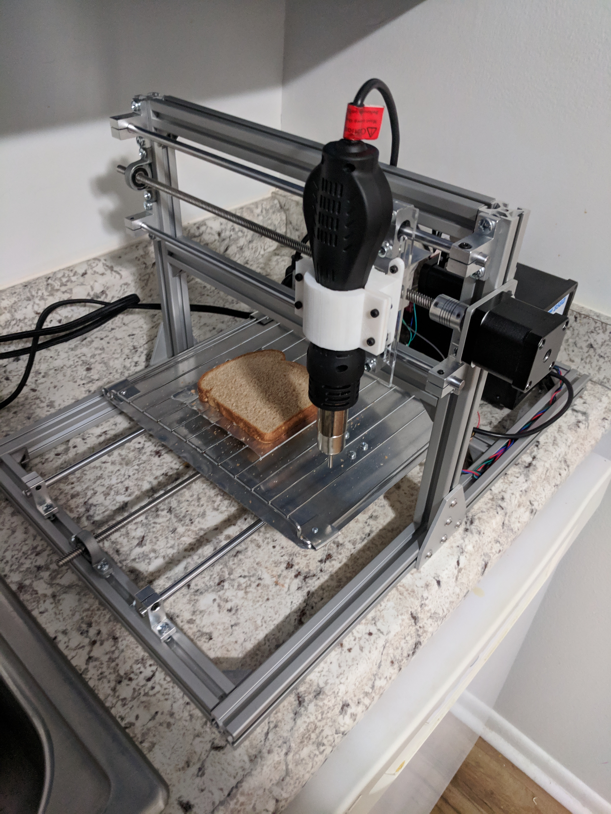
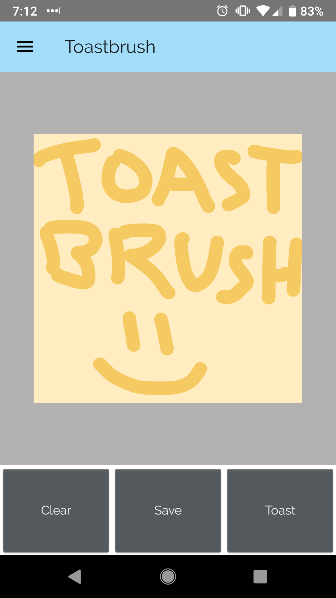

# Toastbrush
Authors: Andrew Vuong, Michael Mackliet, Brett Loertscher

Toaster based on a CNC to toast custom images from a mobile app on bread. 

Backend server for mobile app hosted on Amazon AWS. (No longer running.)
Embedded code to control CNC hardware components through ESP32 microcontroller.
Mobile application using android studio to draw images and send through bluetooth to ESP32.

